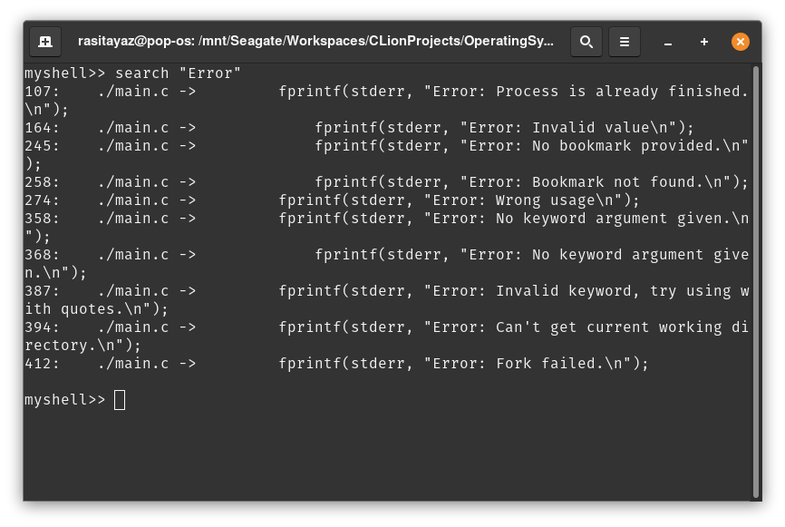
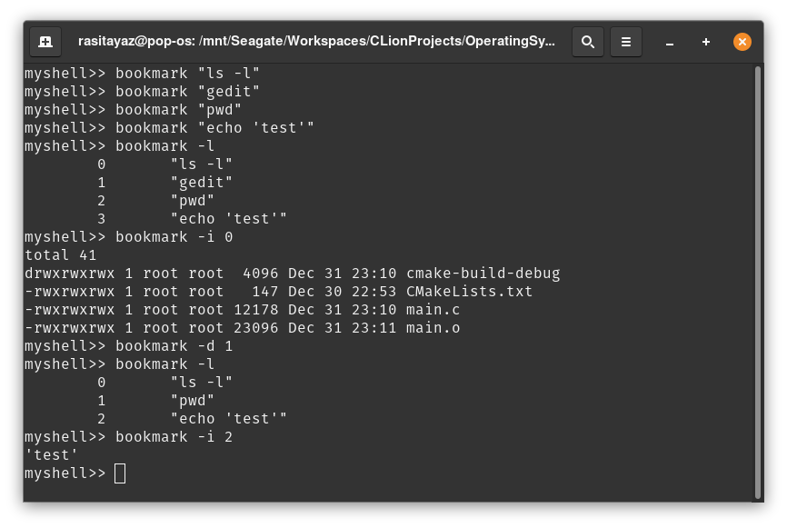
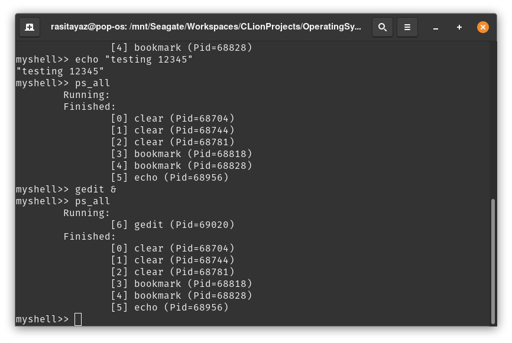
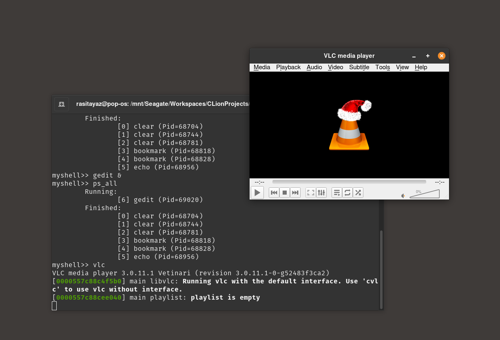

# Custom Shell

This is a basic implementation of a Shell, written in C, demonstrating the basics of how a shell works.

## Details

This shell can either execute its own functions or executable files. Execution process can run on both background and foreground according to the input entered by the user. If ampersand (`&`) is used as an argument at the end of the input, the process works on background and the user can start another process without waiting it to end. Otherwise, it works on foreground and the user has to wait for the process to end.

While executing a process, first, a child process is created by forking the current process. Entered command starts executing when the child process is ready. Program uses `PATH` environment variable to run executables. Thus, it is not necessary to enter the entire path of an executable to be able to run it.

## Functions

Custom functions defined in this shell, implemented by us

* ps_all(): Lists current running and finished processes created by Custom Shell.

* search(): Searches for the phrase entered by the user entered as input in multiple .c and .h files. This function works either recursive or normally. If it works normally, it searches the files in the current directory. If it works in a recursive way, it searches the all files in the sub directories recursively.
This process continues until there are no unchecked files. When the search is complete, the line with the each occurrence of the phrase and the numbers of these lines are printed.

* bookmark(): Stores, lists and executes commands entered by the user as bookmarks. User can bookmark multiple commands and execute them using their indexes.

## Developers

* Ahmet Emirhan Bakkal
* Muhammed Raşit Ayaz
* Yunus Yıldırım

## Screenshots

